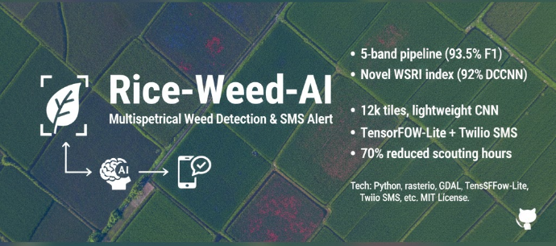

# 🌾 Rice Field Weed Detection using Multispectral Imagery



## 📁 Project Structure

```bash
├── 100x100_chunk_samples/     # 100×100 pixel frames extracted from large datasets
├── data/                       # Multispectral camera data (5 bands) for 6-month rice field monitoring
│   ├── red.tiff
│   ├── blue.tiff
│   ├── green.tiff
│   ├── nir.tiff
│   └── red_edge.tiff
├── notebooks/                  # Python notebooks for analysis
│   └── Weed_Detection_Rice.ipynb
├── output/                     # Generated vegetation indices (NDVI, WDVI, etc.)
├── weed_sms_alert.py           # SMS alert system for farmers
├── requirements.txt            # Dependencies
├── Research work.pdf           # Project documentation
└── LICENSE
```

## 🛠️ Preprocessing Pipeline

- **Geometric Correction** using `rasterio` for spatial alignment
- **Radiometric Calibration** using `GDAL` for reflectance conversion
- **Atmospheric Correction** using `OpenCV` for haze removal
- **Image Enhancement** using `scikit-image` for contrast improvement
- **Noise Reduction** using `Pillow (PIL)` for filtering artifacts

## 🌿 Effective Vegetation Indices for Weed Detection

### **WSRI (Weed-Sensitive Resistance Index)**

- **Purpose**: Discriminates herbicide-resistant vs susceptible weed biotypes
- **Effectiveness**: Outperformed previous VIs with DCNN accuracies of 81.1% and 92.4%  
  **Formula**: `WSRI = (RedEdge - Red) / (RedEdge - Blue)`

### **WDVI (Weighted Difference Vegetation Index)**

- **Purpose**: Separates vegetation from soil background using NIR-red difference
- **Effectiveness**: Most effective for discriminating weeds from rice, water, and soil (93.47% accuracy)  
  **Formula**: `WDVI = NIR - Red`

### **NDVI (Normalized Difference Vegetation Index)**

- **Purpose**: Standard vegetation health assessment using NIR and red bands
- **Effectiveness**: Primary discriminant with better classification than thermal imaging in field studies  
  **Formula**: `NDVI = (NIR - Red) / (NIR + Red)`

### **NDRE (Normalized Difference Red Edge Index)**

- **Purpose**: Early detection and species discrimination using red-edge sensitivity
- **Effectiveness**: Strong interclass separability for early weed detection  
  **Formula**: `NDRE = (NIR - RedEdge) / (NIR + RedEdge)`

### **GNDVI & SAVI (Green NDVI & Soil-Adjusted VI)**

- **Purpose**: Vegetation assessment with soil influence compensation
- **Effectiveness**: Useful when combined with raw bands in deep learning frameworks  
  **Formula**:
- `GNDVI = (NIR - Green) / (NIR + Green)`
- `SAVI = 1.5 × (NIR - Red) / (NIR + Red + 0.5)`

## 📊 Output Format

The processed data generates matrices with the following structure:

```bash
row_indices, column_indices, red_intensity, blue_intensity,
green_intensity, nir_intensity, red_edge_intensity
```

## 🚀 Quick Start

1. Install dependencies: `pip install -r requirements.txt`
2. Run preprocessing in `Weed_Detection_Rice.ipynb`
3. Generate vegetation indices in `output/` folder
4. Configure and run `weed_sms_alert.py` for farmer notifications

## 📈 Application

- **Weed Detection**: Identify weed infestations in rice fields using multispectral analysis
- **Crop Health Monitoring**: Track vegetation health over 6-month growth cycle
- **Farmer Alerts**: Automated SMS notifications for urgent weed interventions

## 🔗 Dependencies

- `rasterio` - Geospatial raster I/O
- `GDAL` - Geospatial data abstraction
- `Pillow` - Image processing
- `scikit-image` - Advanced image algorithms
- `OpenCV` - Computer vision operations

## ⚠️ Important Note

**WSRI is recommended** for discriminating resistant vs susceptible weed biotypes based on published field studies. This index was explicitly developed and shown to improve classification performance in field experiments.
